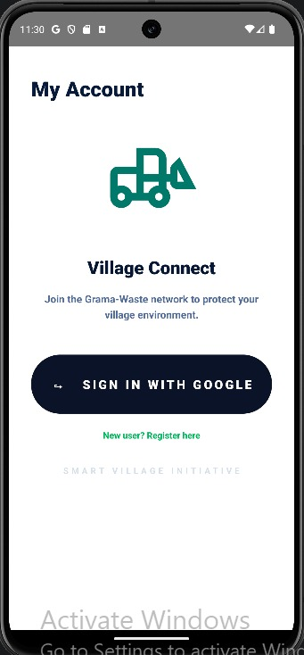
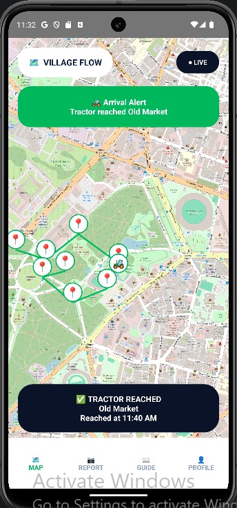
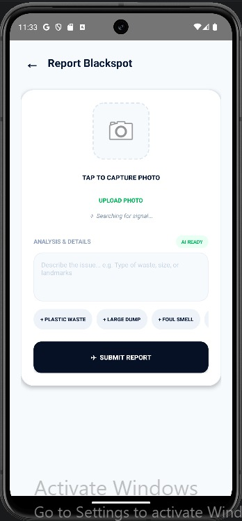
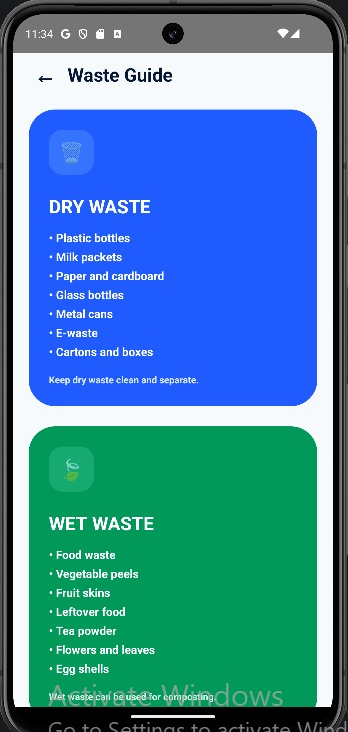
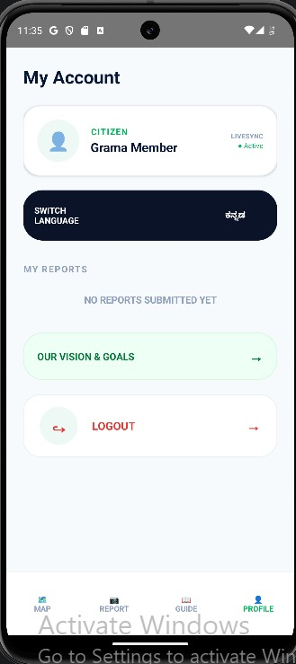

# Grama Waste Tracker

Grama Waste Tracker is a smart village waste management Android application designed to improve waste collection tracking, garbage blackspot reporting, and waste segregation awareness in rural areas.

The app helps citizens track the waste collection tractor, report garbage issues with photo and location details, and learn proper dry and wet waste segregation methods.

---

## Project Overview

In many villages, waste collection is not properly tracked and citizens do not know when the garbage collection tractor will arrive. This may lead to missed waste collection, open dumping, and garbage blackspots.

Grama Waste Tracker provides a digital solution by connecting citizens with the village waste collection system through a mobile application. The app includes live map tracking, report submission, waste guide, profile management, language switching, and logout functionality.

---

## Problem Statement

Waste collection in villages is often irregular and difficult to track. Citizens may not know the exact arrival time of the garbage collection tractor, which causes missed collection and waste dumping in open areas.

There is also no simple digital system for citizens to report garbage blackspots with photo and location proof. Many users are not fully aware of proper dry waste and wet waste segregation.

This project solves the problem by providing a smart mobile application for waste tracking, garbage reporting, and waste segregation awareness.

---

## Features

- Google Sign-In and user registration
- Live map using OpenStreetMap
- Tractor tracking and route points
- Arrival alert for tractor stops
- Report blackspot using camera or gallery
- Location pinning for reports
- Dry waste and wet waste guide
- Profile page with submitted reports
- Delete report option
- English and Kannada language switch
- Our Vision page
- Logout option

---
## Screenshots

### Login Page


### Live Map Page


### Report Blackspot Page


### Waste Guide Page


### Profile Page

## Technologies Used

- Android Studio
- Kotlin
- XML
- Firebase Authentication
- Firebase Realtime Database
- Firebase Firestore
- Google Sign-In
- Google Location Services
- OSMDroid
- OpenStreetMap
- Android Camera
- SharedPreferences

---

## System Flow

```text
User
 |
 v
Login / Register
 |
 v
Authentication
 |
 v
Home Page
 |
 +--> Live Map --> Tractor Tracking --> Arrival Alert
 |
 +--> Report --> Capture/Upload Photo --> Pin Location --> Submit Report
 |
 +--> Guide --> Waste Segregation Information
 |
 +--> Profile --> My Reports / Delete / Language Switch / Vision / Logout
 |
 v
End
